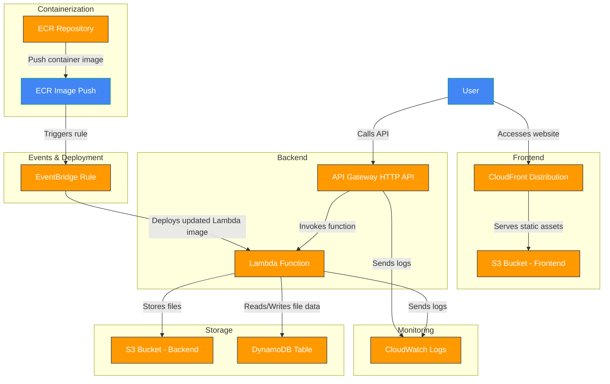

# Smart File Search

[](https://d3k0iqvqbr31j.cloudfront.net/)


Hello, Community!

In this project, we're going to build an application that provides the best possible experience for uploading and searching for file content. To achieve this goal, we need to think about what it really means to provide an optimized upload experience.

### 🚀 Simplified Upload with Drag-and-Drop

The best upload experience is the one that requires the least effort from the user. That's why we chose to implement a drag-and-drop scheme, where you simply drag the file to the application for the upload to be successful.

However, it is essential to consider some important variables:

**File size:** The system must be able to handle small and large files without compromising performance.

**Number of files:** It must be possible to upload multiple files at once, in a practical and intuitive way.

### 📄 Accepted File Types

To provide a comprehensive experience, we would ideally accept any file type: documents, images, videos, and music. However, to keep our scope realistic and achievable within the timeframe available, we will focus solely on documents.

The formats we will accept include:

- [x] DOC, DOCX (Word)
- [x] XLS, XLSX (Excel)
- [x] TXT (Text)
- [x] PDF (General)

### 🔍 Optimized Search Experience

Imagine uploading your favorite book - say, "The Little Prince" - and being able to ask it questions naturally. For example:

 - **You ask:** "What did the fox teach about friendship?"
 - **The system** instantly finds and highlights the exact passage where the fox explains: "It's the time you spent on your rose that makes your rose so important... You become responsible forever for what you've tamed."

This magic happens through semantic search. Instead of just matching keywords, our system understands meaning. When you:

1. Upload files, we convert text into AI-powered "meaning vectors"
2. Ask a question, it finds conceptually related passages
3. Get precise answers with highlighted context

Search through your documents like you're asking a friend. Just type what you're looking for in plain language and get the exact answers you need - no more scrolling or skimming through pages.

### 🎥 Demo
[](https://d3k0iqvqbr31j.cloudfront.net/)

[Smart-File-Search.webm](https://github.com/user-attachments/assets/6120fd4f-9d75-4368-92c5-bf42e9ac0095)

### 🏗️ Archtecture




### 💡 Future Ideas

While our initial focus is on documents, we may expand this system in the future to process other file types. For example:

Videos: Identify and indicate in which specific passage a certain dialogue or word is spoken.

Music: Find the exact minute a word or phrase appears in the lyrics.

For now, we will keep the scope well defined to ensure efficient and high-quality development. We can't wait to see what we build together! 🚀

## 🚧 Backlog

[Access Open Issues (backlog)](https://github.com/feliperooke/smart-file-search/issues)


## 🛠️ Setup Instructions

### Environment Configuration

Before running the application, you need to configure your AWS credentials in the terminal:

```bash
export AWS_ACCESS_KEY_ID=your_access_key_id
export AWS_SECRET_ACCESS_KEY=your_secret_access_key
```

Replace `your_access_key_id` and `your_secret_access_key` with your actual AWS credentials.

### Deployment Commands

To deploy the backend infrastructure and application:

```bash
make backend-deploy-all
```

To deploy only the frontend:

```bash
make frontend-deploy-all
```

These commands will handle the infrastructure deployment, build the application, and deploy it to AWS.


