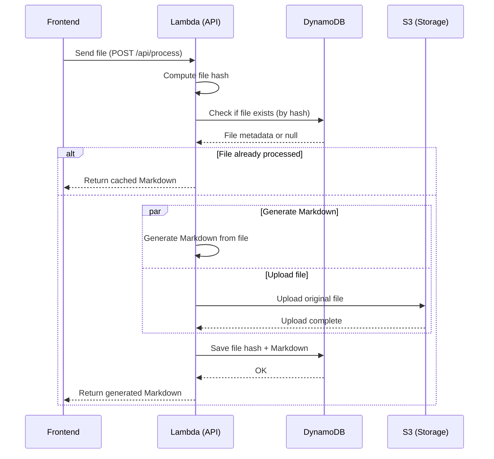

# Smart File Search (Backend)

This is the backend of the Smart File Search project, built with FastAPI and deployed on AWS Lambda. The application processes various file formats (PDF, DOCX, XLSX) and converts them to Markdown format for efficient searching and viewing.

## 📋 Requirements

### Local Development
- Python 3.12
- Poetry (Python package manager)
- Docker (for containerized development)

### AWS Deployment
- AWS CLI configured with appropriate credentials
- Terraform installed
- Docker (for building container images)

## 🏗️ Project Structure

```
.
├── app/                    # Application source code
│   ├── core/              # Core functionality and configurations
│   ├── common/            # Shared utilities and helpers
│   ├── file_processing/   # File processing logic
│   ├── text_extraction/   # Text extraction from different file formats
│   ├── uploads/           # File upload handling
│   ├── health/            # Health check endpoints
│   └── main.py           # Application entry point
├── terraform/             # Infrastructure as Code
├── tests/                 # Test files
├── Dockerfile            # Container definition
├── pyproject.toml        # Python dependencies and project metadata
└── Makefile              # Build and deployment automation
```

## 🔄 Architecture Flow

The application follows this flow for processing files:



## 🛠️ Local Development Setup

### 1. Install Dependencies
```bash
# Install Poetry
curl -sSL https://install.python-poetry.org | python3 -

poetry env use python3.12

# Install project dependencies
poetry install
```

### 2. Environment Setup
Create a `.env` file with the following variables:
```env
AWS_REGION=us-east-1
S3_BUCKET_NAME=your-bucket-name
LAMBDA_NAME=smart-file-search-lambda
ECR_REPOSITORY=smart-file-search-repository
```

### 3. Run the Development Server
```bash
poetry run uvicorn app.main:app --reload
```

## 🧪 Testing

Run the test suite:
```bash
poetry run pytest
```

For coverage report:
```bash
poetry run pytest --cov=app --cov-report=term-missing
```

## ☁️ AWS Deployment

### 1. Build and Deploy
```bash
# Build and deploy using Make
make all
```

This will:
1. Create/update ECR repository
2. Build and push Docker image
3. Deploy Lambda function and API Gateway
4. Run tests against the deployed API

### 2. Manual Deployment Steps
If needed, you can run the steps manually:

```bash
# Initialize Terraform
cd terraform
terraform init

# Create ECR repository
terraform apply -target=aws_ecr_repository.app

# Build and push Docker image
make build
make push

# Deploy remaining infrastructure
terraform apply
```

### 3. Clean up
To remove all deployed resources:
```bash
make clean
cd terraform
terraform destroy
```

## 📝 API Endpoints

- `POST /api/process` - Process a file and convert to Markdown
- `GET /api/health` - Health check endpoint
- `GET /api/files/{file_id}` - Retrieve processed file content

## 🔧 Configuration

The application uses the following AWS services:
- Lambda for serverless compute
- API Gateway for HTTP endpoints
- S3 for file storage
- DynamoDB for caching and metadata
- CloudWatch for logging

## 📚 Dependencies

### Main Dependencies
- FastAPI - Web framework
- Mangum - AWS Lambda adapter
- markitdown - File format conversion
- boto3/aioboto3 - AWS SDK
- python-multipart - File upload handling

### Development Dependencies
- pytest - Testing framework
- pytest-cov - Test coverage
- httpx - HTTP client for testing